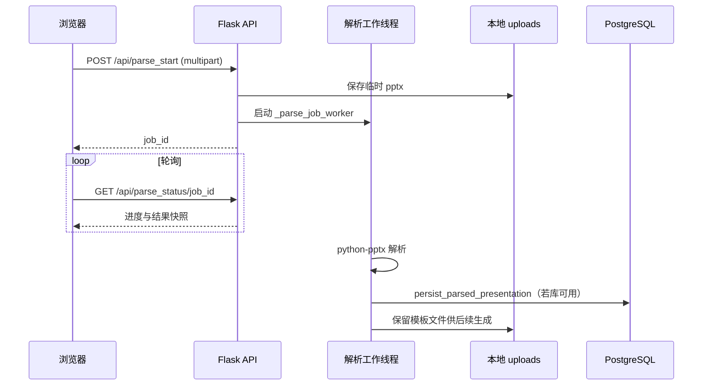
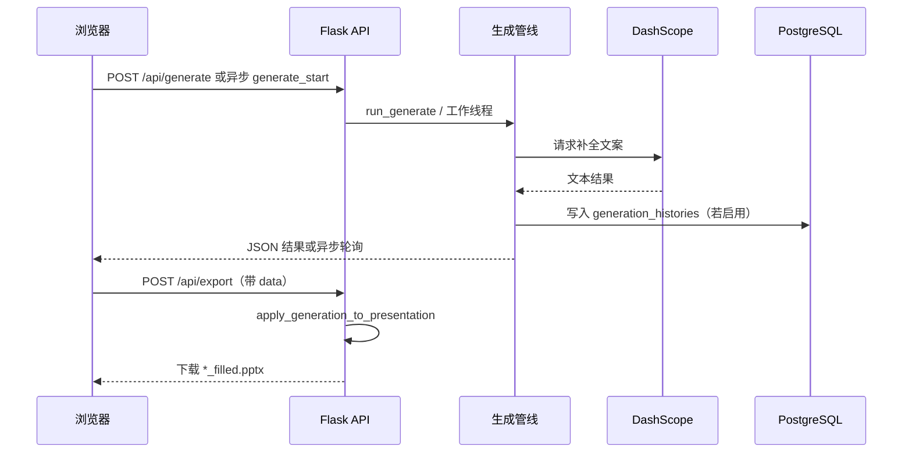
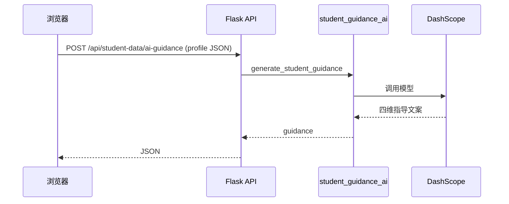
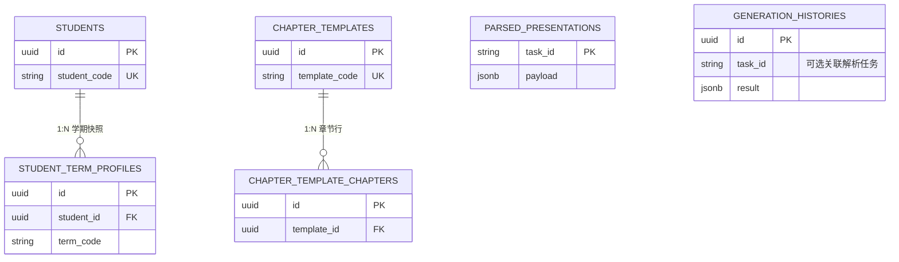

# AiReport 项目交接文档

## 文档说明

本文件用于项目移交与长期维护，说明 **AiReport** 仓库的业务定位、功能边界、技术架构、数据模型与运维资产。文中 **Mermaid** 图（时序图、ER 图）需在支持 Mermaid 的编辑器或 Git 托管平台预览中查看；若需纸质材料，可将对应代码块导出为矢量图后插入。

下文在描述行为时均以当前 `main` 分支实现为准；若代码变更，须同步修订本文件中的路径、接口名与配置项。

---

## 第一章：项目概述

### 本章导读

本章说明项目产生的业务动因、要解决的问题，以及建设时期达成的目标层级划分。阅读本章可建立对系统「为何存在」与「做到什么程度算完成」的统一认识，再进入后续功能与架构章节。

### 1.1 项目背景

教育咨询与教学汇报工作中，交付物大量使用 **PowerPoint** 固定母版：版式重复、占位符分散在多张幻灯片中。纯人工填写耗时，且同一学生的基础信息、学习画像与规划结论在多次报告间难以保持一致引用。数据若只散落在本地文件，机构侧无法集中检索历史生成记录与模板版本。

**AiReport** 将上述工作收敛为一套 **Web 应用**：用户上传 **`.pptx`** 模板后，服务端用程序解析幻灯片内的形状与文本结构，将结构化的解析结果持久化或缓存；在生成阶段，系统按用户指定的主题、页码范围、补充说明以及可选的章节映射与学生档案字段，调用 **大语言模型接口** 产出文本，再写回 **`.pptx`** 并支持下载。学生主档与学期维度档案、章节模板定义均落在 **PostgreSQL**，与生成历史一并支撑列表、详情与再次导出。

当前实现不替代 Office 客户端的设计功能；**`.ppt`** 格式不在支持范围内，须在 Office 或兼容软件中另存为 **`.pptx`** 后再上传。

### 1.2 开发目标

**业务目标**

- **可解析**：对上传模板给出按页、按组件类型的结构化描述，支撑人工核对模板是否可被自动填充逻辑覆盖。
- **可生成**：在选定幻灯片集合上，依据主题与约束生成中文案，并支持章节模板与学生数据的联合引用。
- **可追溯**：生成任务结果写入历史表，支持按记录查看与导出，并配合保留策略做空间回收。

**产品与工程目标**

- **单进程应用形态**：Flask 同时提供页面与 JSON API，静态脚本与样式位于 `static/`，模板位于 `templates/`，降低前后端分仓协作成本。
- **配置外置**：数据库连接、模型密钥、超时与批大小等通过环境变量与 `.env` 注入，同一镜像可在开发机与服务器通过不同环境文件运行。
- **持久化清晰**：关系数据进 PostgreSQL；上传的模板文件与部分导出缓存落在应用配置的 `uploads` 目录（Docker 场景下通过卷挂载）。

---

## 第二章：功能介绍

### 本章导读

本章按业务域列出已实现能力，并区分 **系统页面**（路径、名称、功能与截图占位）与 **`/api` 接口**，便于接手人定位代码与联调。页面由 `ppt_report/blueprints/web.py` 注册；接口由 `ppt_report/blueprints/api.py` 与根路径 `export_bp`（`/export/<task_id>`）注册。

### 2.1 系统页面与功能

下表汇总系统对外提供的 **浏览器页面**：左起依次为访问路径、页面名称、功能说明。第四列 **界面截图** 为预留位，交接时在对应环境打开该路径后将截图嵌入本列（飞书文档、Word 或 Markdown 图片语法均可），便于后续阅读者对照界面理解功能。

| 页面路径 | 页面名称 | 功能说明 | 界面截图 |
|----------|----------|----------|----------|
| `/` | 入口重定向 | 无独立界面，请求根路径时重定向至总览页 `/overview` |  |
| `/overview` | 总览 / 工作台 | 展示系统级统计；在数据库可用时列出最近若干条生成历史摘要 |  |
| `/upload` | PPT 上传与解析 | 选择并上传 `.pptx`，发起解析任务，查看解析进度与结果入口 |  |
| `/generate` | 文案生成 | 基于已解析模板配置主题、选页与补充说明，发起生成并导出 |  |
| `/presentations/<task_id>` | 解析任务详情 | 查看指定 `task_id` 的解析结构、组件说明与原始 JSON |  |
| `/partials/generate-form` | 生成面板片段 | 供其他页面异步加载的生成表单片段；需带 `task_id` 查询参数，一般不单独作为整页入口 |  |
| `/chapter-templates` | 章节模板列表 | 浏览、检索已配置的章节模板 |  |
| `/chapter-templates/new` | 新建章节模板 | 创建新的章节模板及下属章节行 |  |
| `/chapter-templates/<template_id>` | 章节模板详情 | 查看指定模板的元数据与章节结构 |  |
| `/chapter-templates/<template_id>/edit` | 编辑章节模板 | 修改模板属性及各章节标题、提示与排序 |  |
| `/student-data` | 学生数据列表 | 检索与浏览学生档案条目 |  |
| `/student-data/new` | 新建学生数据 | 录入学生主档与学期维度字段 |  |
| `/student-data/<record_id>` | 学生数据详情 | 只读查看单条学生档案 |  |
| `/student-data/<record_id>/edit` | 编辑学生数据 | 修改单条学生档案 |  |
| `/history` | 生成历史列表 | 按时间浏览历史生成记录 |  |
| `/history/<record_id>` | 生成历史详情 | 查看单条生成记录的输入与输出内容 |  |

### 2.2 接口与业务能力

以下接口前缀均为 **`/api`**，除非单独标注。方法未列出的均为 GET。

| 能力域 | 接口与方法 | 说明 |
|--------|------------|------|
| 解析任务列表 | `GET /presentations` | 返回解析任务摘要列表及 `db_enabled` 标志 |
| 解析上传 | `POST /parse_start` | 表单上传 `ppt_file`，可选 `replace_task_id`；返回 `job_id` |
| 解析进度 | `GET /parse_status/<job_id>` | 轮询异步解析任务状态与结果 |
| 单任务查询 | `GET /presentations/<task_id>` | 供生成前校验：文件名、页数、章节分组、模板文件是否存在 |
| 删除解析 | `DELETE /presentations/<task_id>` | 删除解析记录、模板文件、缓存及该任务章节参考图 |
| 重命名展示名 | `PATCH /presentations/<task_id>` | JSON body：`file_name`，更新库中展示文件名并同步缓存中的展示名 |
| 同步生成 | `POST /generate` | JSON：`task_id`、`topic`、`selected_slides`、`extra_content`、可选 `chapter_ref` |
| 异步生成 | `POST /generate_start` | 表单：`task_id`、`topic`、`selected_slides`、`chapter_ref_json` |
| 异步进度 | `GET /generate_status/<job_id>` | 轮询生成任务 |
| 导出 PPTX | `POST /export` | JSON：`task_id`、可选 `data`、`chapter_ref`；返回填充后的文件流 |
| 导出 PPTX | `GET /export/<task_id>` | 注册在 **`export_bp`**，根路径，使用内存中最近一次生成结果 |
| 生成历史 | `GET /generation_history`、`GET /generation_history/<record_id>`、`DELETE /generation_history/<record_id>` | 列表、详情、删除；删除依赖数据库可用 |
| 学生数据 | `GET/POST /student-data`、`GET/PUT/DELETE /student-data/<record_id>` | CRUD 与列表查询参数 `q` |
| AI 成长指导 | `POST /student-data/ai-guidance` | JSON：`profile`、`content`；调用 `student_guidance_ai` |
| 章节模板 | `GET/POST /chapter-templates`、`GET/PUT/DELETE /chapter-templates/<template_id>` | 模板 CRUD |
| 章节引用解析 | `POST /resolve-chapter-reference` | JSON：`task_id`、`chapter_template_id`、`student_data_id`、可选 `use_llm` |
| 章节参考图 | `POST /chapter-ref-screenshot`、`DELETE /chapter-ref-screenshot/<task_id>/<filename>`、`GET /chapter-ref-images/<task_id>/<filename>` | 上传、删除、读取参考截图 |

**配置与限制**：单次请求体大小上限由 `config.max_content_bytes()` 决定，对应 `MAX_UPLOAD_MB`（默认 200MB）。生成历史在进程内由后台线程按 `GENERATION_HISTORY_CLEANUP_INTERVAL_SEC` 周期清理超 `GENERATION_HISTORY_RETENTION_DAYS` 的记录。

---

## 第三章：系统架构

### 本章导读

本章给出技术选型表、各层职责说明，以及三条核心链路的时序图。阅读顺序建议为：先对照技术栈表理解依赖，再读各时序图前的文字说明，最后看图。

### 3.1 技术栈与目录职责

| 层级 | 选型与说明 |
|------|------------|
| 运行时 | Python 3；入口 `app.py` 暴露 Flask `app` 供 Gunicorn 加载 |
| Web 框架 | Flask；蓝图 `web_bp`、`api_bp`、`export_bp` 在 `ppt_report/__init__.py` 中注册 |
| ORM 与驱动 | SQLAlchemy 2.x；`psycopg2-binary`；模型与会话封装在 `ppt_report/models/db.py` |
| PPT 读写 | `python-pptx`；解析与写回逻辑分布在 `ppt_report/services/pptx_document.py` 等模块 |
| 大模型调用 | HTTP 请求至阿里云 DashScope；密钥读取 `DASHSCOPE_API_KEY`，未配置时回退 `OPENAI_API_KEY`；模型名 `DASHSCOPE_MODEL`；具体参数见 `text_generation.py`、`student_guidance_ai.py` 等 |
| 前端 | Jinja2 模板；`static/js/app/` 下按页面拆分的脚本；样式 `static/css/app.css` |
| 生产服务进程 | `gunicorn`（`requirements.txt`）；`Dockerfile` 中默认绑定 `0.0.0.0:5000` |
| 容器编排 | `docker-compose.yml` 中 `db`（PostgreSQL 16）与 `web`（构建当前目录） |

**应用配置**集中在 `ppt_report/config.py`：`BASE_DIR` 为项目根；`UPLOAD_DIR` 为 `uploads/`；`FILLED_EXPORT_DIR` 为 `uploads/filled_exports/`；数据库 URL 取自 `DATABASE_URL`。

**部署形态**：开发可直接 `python app.py`（Flask 调试）；生产推荐使用 Gunicorn 或 Docker 镜像。数据库与 Web 可同主机或分容器；大模型为出站 HTTPS，不涉及入站回调。

### 3.2 核心时序图

以下三张图分别对应 **解析链路**、**生成与导出链路**、**学生成长指导链路**。图中参与者名称与代码模块或存储一致，便于对照日志与断点。

#### 3.2.1 上传并解析 PPT

解析请求进入后，主线程仅负责落盘临时文件、登记异步任务并返回 `job_id`；实际解析在守护线程 `_parse_job_worker` 中执行。解析完成后，若数据库已启用，调用 `persist_parsed_presentation` 写入 `parsed_presentations`；模板文件保留在 `uploads` 供后续生成读取。

#### 3.2.2 生成文案并导出 PPT

生成可通过同步 JSON 接口一次性返回，或通过 `generate_start` 与 `generate_status` 异步执行；生成管线内部调用大模型服务，成功后将历史写入 `generation_histories`（数据库可用时）。导出阶段从磁盘加载原始模板，将生成结果与章节引用一并交给 `apply_generation_to_presentation`，再返回下载流。

#### 3.2.3 学生数据与 AI 成长指导

前端将学生维度结构以 JSON 提交至 `POST /api/student-data/ai-guidance`，服务端组装提示后调用 `generate_student_guidance`，仅产生指导类文案，不直接写入数据库；是否落库由用户在前端保存学生档案的独立流程完成。

---

## 第四章：数据库设计

### 本章导读

本章描述持久化表的业务含义、表间关系及与代码的对应关系。物理建表由应用启动时 `init_db` → `Base.metadata.create_all` 完成；运维侧仍需预先创建数据库实例与用户权限，脚本模板见 `deploy/sql/01_create_database.sql`。

### 4.1 核心表结构说明

| 表名 | 主键与核心字段 | 业务含义 |
|------|----------------|----------|
| `parsed_presentations` | `task_id`（字符串，PK）；`payload` JSONB | 一次上传解析任务的完整结果快照，含文件名、页数、各页组件结构 |
| `generation_histories` | `id` UUID；`task_id` 可空；`result` JSONB | 一次生成任务的输入摘要与输出结构，供历史列表与详情展示 |
| `students` | `id` UUID；`student_code` 唯一 | 学生主档：学号、姓名、英文名、服务起始日、规划师等跨学期稳定字段 |
| `student_term_profiles` | `id` UUID；`student_id` FK → `students.id`；`term_code` 与 `student_id` 唯一约束 | 某一学期的四维业务字段与 `extra_json` 扩展 |
| `chapter_templates` | `id` UUID；`template_code` 唯一 | 章节模板头：名称、描述、启用标志 |
| `chapter_template_chapters` | `id` UUID；`template_id` FK → `chapter_templates.id` | 模板下的章节行：标题、hint、排序；删除模板时级联删除 |

`generation_histories.task_id` 与 `parsed_presentations.task_id` 在业务上可指向同一解析任务标识，**未建立数据库外键**，以便历史记录在模板删除后仍可保留或独立展示。

### 4.2 ER 图

实体关系下图展示：**学生** 与 **学期档案** 为一对多；**章节模板** 与 **模板章节行** 为一对多；**解析任务** 与 **生成历史** 在图中独立成表，关联仅靠 `task_id` 字符串。

---

## 第五章：项目资产与地址

### 本章导读

本章汇总代码托管位置、运行时可变地址占位方式，以及仓库内与部署相关的文件索引。线上访问地址与内部文档链接属运维资产，变更后须更新本表。

### 5.1 项目仓库地址

| 类型 | 地址 |
|------|------|
| 代码仓库（GitHub） | `https://github.com/lazy233/AiReport.git` |

若仓库迁移至其他托管平台，应在本表替换 URL，并在权限上限制可写人员与合并策略。

### 5.2 环境访问地址

| 环境 | 地址 |
|------|------|
| 生产环境 | **由运维填写**：对外提供服务的完整 URL 或 `协议://主机:端口` |
| 本地开发 | `http://127.0.0.1:5000`（Flask 默认开发端口；生产以 Gunicorn 或反向代理为准） |

### 5.3 相关文档与脚本

| 说明 | 路径 |
|------|------|
| 运行说明与 Docker 步骤 | 仓库根目录 `README.md` |
| 环境变量模板 | `.env.example` |
| 容器构建与编排 | `Dockerfile`、`docker-compose.yml` |
| 仅创建数据库与用户 | `deploy/sql/01_create_database.sql` |
| 本交接说明 | `docs/项目交接文档.md` |

---

**文档维护约定**：与 `main` 分支行为不一致时，以代码为准并回写本文档；表结构或对外接口发生破坏性变更时，须更新第四章与第二章对应表格，并复核时序图参与者是否仍准确。
